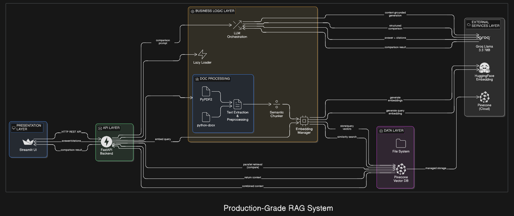

# 🚀 Production RAG System

AI-powered Retrieval-Augmented Generation system with FastAPI backend and Streamlit frontend.

## 📋 Overview

Production-grade RAG system with:
- **FastAPI** backend with lazy-loaded services (port 8000)
- **Streamlit** UI frontend (port 8502)
- **Groq Llama 3.3 70B** for intelligent responses
- **HuggingFace all-MiniLM-L6-v2** embeddings (384-dim, 80MB)
- **Pinecone** serverless vector database
- **Document comparison** and **data management** features

---

## ⚡ Quick Start

### 1. Install Dependencies
```bash
pip install -r requirements.txt
```

### 2. Configure API Keys

Edit `.env` file:

```env
GROQ_API_KEY=your_groq_api_key
PINECONE_API_KEY=your_pinecone_api_key
PINECONE_INDEX_NAME=rag-index
PINECONE_DIMENSION=384
```

**Get API Keys:**
- **Groq** (Free): https://console.groq.com/keys
- **Pinecone** (Free tier): https://app.pinecone.io/

### 3. Create Pinecone Index

**Option A: Using Script (Recommended)**
```bash
python recreate_index.py
```

**Option B: Via Pinecone Website**
1. Go to https://app.pinecone.io/
2. Click "Create Index"
3. Configure settings:
   - Name: `rag-index`
   - Dimensions: `384`
   - Metric: `cosine`
   - Cloud: `aws` / Region: `us-east-1`

### 4. Start Servers

**Terminal 1 - Start FastAPI:**
```bash
cd app
python main.py
```

**Terminal 2 - Start Streamlit:**
```bash
streamlit run streamlit_app.py
```

**Access:**
- Streamlit UI: http://localhost:8502
- FastAPI Docs: http://localhost:8000/docs

---

## 📦 Project Structure

```
prorag/
├── streamlit_app.py              # Streamlit UI (API client)
├── recreate_index.py             # Pinecone index setup
├── clear_pinecone.py             # Data cleanup utility
├── requirements.txt              # Dependencies
├── .env                          # API keys & config
│
└── app/                          # FastAPI Backend
    ├── main.py                   # FastAPI entry point
    │
    ├── config/
    │   └── settings.py           # Environment config
    │
    ├── routes/
    │   └── rag_routes.py         # API endpoints
    │
    ├── services/
    │   ├── __init__.py           # Lazy service loader
    │   │
    │   ├── rag/
    │   │   ├── embeddings/
    │   │   │   └── embedding_manager.py    # HuggingFace embeddings
    │   │   └── llm/
    │   │       └── groq_generator.py       # Groq LLM
    │   │
    │   └── vectorstore/
    │       └── pinecone_manager.py         # Pinecone ops
    │
    └── utils/
        ├── document_processor.py # PDF/DOCX processing
        └── chunking.py           # Text chunking
```

---

## 🏗️ Architecture

This system uses a **hybrid architecture** with separated backend and frontend for optimal performance:

### **Two-Tier Design:**
1. **FastAPI Backend** (Port 8000) - Heavy processing, model hosting
2. **Streamlit Frontend** (Port 8502) - Lightweight UI, API client

### **Key Components:**
- **Document Processing**: PyPDF2, python-docx for multi-format support
- **Embedding Layer**: HuggingFace all-MiniLM-L6-v2 (384-dim, 80MB)
- **Vector Database**: Pinecone Serverless (cosine similarity)
- **LLM Generation**: Groq Llama 3.3 70B (context-grounded)

### **Data Flow:**
```
Upload: User → FastAPI → Process → Chunk → Embed → Pinecone
Query:  User → FastAPI → Embed Query → Pinecone Search → Groq LLM → Answer
```

### **System Architecture Diagram:**



---

## 🎯 Features

### ✅ Document Upload & Processing
- Upload PDF, DOCX, TXT, Markdown files
- Automatic chunking (1000 tokens, 200 overlap)
- Batch embedding generation (memory-efficient)
- Metadata extraction with filename tracking
- **Auto-replacement**: Re-uploading replaces old version

### ✅ Intelligent Query
- Natural language questions
- Semantic similarity search (top-k retrieval)
- Context-grounded responses with citations
- Adjustable parameters (temperature, top_p, max_tokens)
- Source attribution with similarity scores

### ✅ Document Comparison
- Compare two documents on same query
- Side-by-side analysis
- Highlights similarities and differences
- Retrieves relevant context from both documents

### ✅ Data Management
- **Clear All Data**: Delete all vectors from UI
- **Delete Individual Documents**: Per-document deletion
- **Clear Script**: Standalone `clear_pinecone.py`
- **Auto-cleanup**: Old versions deleted on re-upload

### ✅ Production Features
- **Lazy Loading**: Models load on first API call
- **Memory Optimized**: 384-dim embeddings (vs 768-dim)
- **Batch Processing**: Prevents memory overflow
- **Error Handling**: Graceful namespace/404 handling
- **CORS Enabled**: Cross-origin API access

---

## 🖥️ Usage Guide

### Upload Documents
1. Open http://localhost:8502
2. Drag & drop files or use file picker
3. Click "🚀 Upload & Process"
4. See uploaded documents list below

### Query Documents
1. Enter question in "🔍 Ask a Question" section
2. Adjust sidebar settings if needed:
   - Top K Results (1-10)
   - Temperature (0-1.0)  
   - Top P (0-1.0)
   - Max Tokens (100-2000)
3. Click "🔍 Search"
4. View answer with source citations

### Compare Documents
1. Go to "⚖️ Compare Documents" section
2. Enter your question
3. Select two documents from dropdowns
4. Click "🔄 Compare"
5. View structured comparison

### Manage Data
1. Sidebar → "🗑️ Data Management"
2. Click "Clear All Data" (requires confirmation)
3. Or click 🗑️ next to individual documents

---

## 🔌 API Endpoints

### Health Check
```bash
GET http://localhost:8000/health
```

### Upload Document
```bash
POST http://localhost:8000/api/upload
Content-Type: multipart/form-data

file=@document.pdf
```

### Query Documents
```bash
POST http://localhost:8000/api/query
Content-Type: application/json

{
  "query": "What are the main findings?",
  "top_k": 5,
  "temperature": 0.3,
  "top_p": 0.95,
  "max_tokens": 1000
}
```

### Compare Documents
```bash
POST http://localhost:8000/api/compare
Content-Type: application/json

{
  "query": "Compare methodologies",
  "doc1_name": "report1.pdf",
  "doc2_name": "report2.pdf",
  "top_k": 3
}
```

### Delete Document
```bash
DELETE http://localhost:8000/api/documents/{filename}
```

### Delete All Documents
```bash
DELETE http://localhost:8000/api/documents
```

**Full API Documentation**: http://localhost:8000/docs

---

## ⚙️ Configuration

All settings in `.env`:

### Core Settings
```env
# Main LLM
GROQ_API_KEY=your_key_here
GROQ_MODEL=llama-3.3-70b-versatile

# Embeddings (384 dimensions)
HUGGINGFACE_EMBEDDING_MODEL=sentence-transformers/all-MiniLM-L6-v2

# Vector Database
PINECONE_API_KEY=your_key_here
PINECONE_INDEX_NAME=rag-index
PINECONE_DIMENSION=384
PINECONE_CLOUD=aws
PINECONE_REGION=us-east-1

# Chunking
CHUNK_SIZE=1000
CHUNK_OVERLAP=200

# Retrieval
TOP_K_RESULTS=5
SIMILARITY_THRESHOLD=0.5

# LLM Parameters
LLM_TEMPERATURE=0.3
LLM_TOP_P=0.95
LLM_MAX_TOKENS=1000
```

### Tuning Tips

**For precise answers:**
```env
TOP_K_RESULTS=3
SIMILARITY_THRESHOLD=0.7
LLM_TEMPERATURE=0.2
```

**For creative exploration:**
```env
TOP_K_RESULTS=8
SIMILARITY_THRESHOLD=0.4
LLM_TEMPERATURE=0.7
```

---

## 🛠️ Utilities

### Recreate Pinecone Index
```bash
python recreate_index.py
```
- Deletes old index (if exists)
- Creates new index with 384 dimensions
- Interactive confirmation required

### Clear All Data
```bash
python clear_pinecone.py
```
- Deletes all vectors from Pinecone
- Keeps index structure intact
- Requires 'yes' confirmation

---

## 📊 Tech Stack

| Component | Technology |
|-----------|-----------|
| Backend | FastAPI |
| Frontend | Streamlit |
| LLM | Groq Llama 3.3 70B |
| Embeddings | HuggingFace all-MiniLM-L6-v2 (384-dim) |
| Vector DB | Pinecone Serverless |
| Document Parser | PyPDF2, python-docx |
| Architecture | Lazy Loading with Service Registry |

---

## 🚨 Troubleshooting

### Port Already in Use
```bash
# Find process using port
netstat -ano | findstr :8000

# Kill process or change port in .env
```

### UI Not Loading
```bash
# Ensure FastAPI backend is running
cd app
python main.py
# Should see: Uvicorn running on http://0.0.0.0:8000

# Ensure Streamlit is running
streamlit run streamlit_app.py
# Should open browser to: http://localhost:8502
```

### Pinecone Errors
- Verify API key in `.env`
- Check index exists (dimension=384, metric=cosine)
- Ensure cloud/region matches (e.g., "aws" / "us-east-1")

**"Namespace not found"**: Normal if no documents uploaded yet

### Out of Memory
- Reduce `CHUNK_SIZE` to 500
- Reduce `TOP_K_RESULTS` to 3
- Close other applications

### Slow Responses
- Check internet connection (API calls)
- Verify Groq API is not rate-limited
- Reduce `TOP_K_RESULTS` or `MAX_TOKENS`

---

## 🎓 Key Design Decisions

### Why Lazy Loading?
- **Prevents memory overflow** at startup
- Models load only when first needed
- FastAPI starts instantly
- Production-optimized approach

### Why all-MiniLM-L6-v2?
- **384 dimensions** (vs 768 in all-mpnet-base-v2)
- **80MB model** (vs 420MB)
- 81% smaller, minimal quality loss
- Ideal for production deployment

### Why Groq Llama 3.3 70B?
- **Fast inference** on Groq's LPU infrastructure
- Free tier with generous limits
- Excellent reasoning capabilities
- 70B parameter model for complex tasks

### Why Hybrid Architecture?
- **FastAPI**: Heavy processing, model hosting
- **Streamlit**: Lightweight UI, no models loaded
- Clear separation of concerns
- Easy to scale independently

### Hallucination Prevention
1. Context-only responses (no external knowledge)
2. Similarity threshold filtering
3. Mandatory source citations per document
4. Low temperature (0.3 default)
5. Controlled context windows
6. Source mapping (document-level, not chunk-level)

---

## 📝 Example Workflow

```bash
# 1. Setup
pip install -r requirements.txt
python recreate_index.py  # Create Pinecone index

# 2. Start servers (2 terminals)
# Terminal 1
cd app && python main.py

# Terminal 2  
streamlit run streamlit_app.py

# 3. Use system
# - Open http://localhost:8502
# - Upload PDF documents
# - Ask questions
# - Compare documents
# - Manage data

# 4. Clean up (if needed)
python clear_pinecone.py  # Clear all data
```

---

## 🤝 Support

**Common Issues:**
1. Check API keys in `.env` are valid
2. Ensure Pinecone index exists with correct dimensions (384)
3. Verify both servers running (FastAPI on port 8000, Streamlit on port 8502)
4. Check internet connection for API calls
5. Python 3.11+ installed

**Debugging:**
- Check FastAPI logs in Terminal 1
- Check Streamlit logs in Terminal 2
- Visit http://localhost:8000/docs for API testing
- Review uploaded documents at http://localhost:8502

---

**Ready to build intelligent document search!** 🚀
